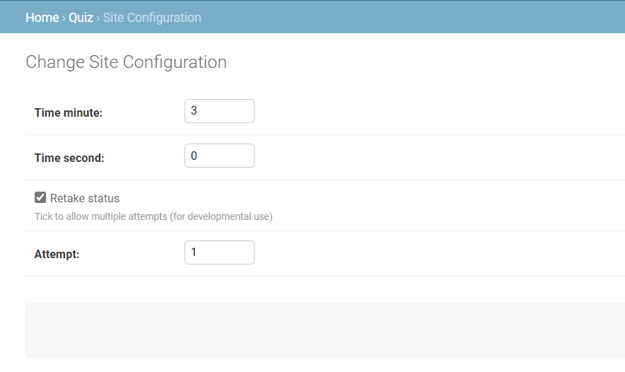

quiz_app
The app is created to help in screening candidates for a grant, a short story is displayed and 10 Questions are asked based on the story. The app consists of three pages: 
•	start.html to display instructions to the user before the quiz begins, 
•	question.html to display the passage, questions, options, timer and allows the user to submit at will
•	result.html to display the user score and tells the user if the quiz was passed or not. 
Note: the retake quiz button is for development purposes. For easy assessment, the first option is the correct option and the set time is 3 minutes and can be edited at will.
TOOLS
	Python (Django framework), Html and CSS, Vanilla JavaScript, Django-Solo
FUNCTIONALITIES
Admin:
	/admin/ helps the quiz administrator to edit and add the passage, the question, the options and also adjust the timer by setting the time minute and time second via the site configuration model. https://veekmcqs.herokuapp.com/admin 

Submission:
	Submission can either occur automatically when the time run out or manually by clicking the any of the two submit buttons available. Whenever the submit button is clicked it triggers a confirm function to make sure the user is ready to submit.
Timer:
	The timer is placed at the top of the screen to make it easy for the user to keep an eye on. 
LINKS
Project Link: https://veekmcqs.herokuapp.com/
GitHub Link: https://github.com/veekthor04/quiz_app
